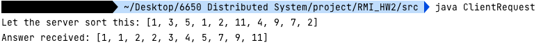

# RMI sort server example
Homework question:
```
See the Coding Tutorial PDF provided, and the below references.  Do your own study of RMI 
Java examples to implement this.  Implement a Java RMI Application in which the Client object 
is sending a list of 10 integers to the Server, and a remote method ['sort()'] o the server returns 
a sorted version of the same list back to the Client.
```


RMI step:
1. Write the interface and extends `Remote`, which indicate the interface will be invoke remotely
```java
public interface Server extends Remote{
    ...
}
```

2. Implement the interface, `serverImpl.java`
3. Write a server and a client


Make sure you compile all the file in the `src` folder.

And then:

`cd src`, then enter:
```aidl
rmiregistry
```

```aidl
java SortServer
```

```
java ClientRequest
```
to your terminal one by one.

### Result
