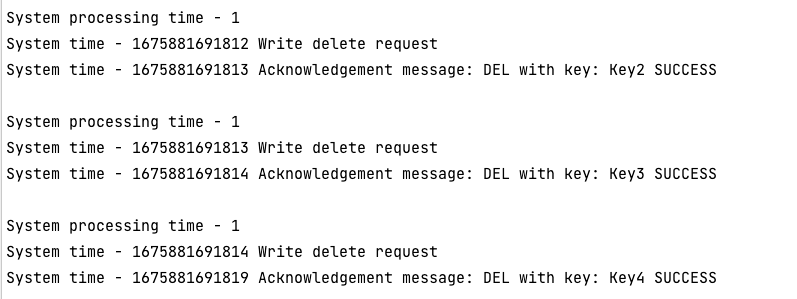

# NEU CS6650 Project1
Yiqiu Huang
This project implement a server key-value storage with UDP and TCP in java

To run this project, compile all the file in `src` folder:
```java
javac *.java
```

to start the TCP server:
```java
 java TCPServer.java 9998
```
Open a new terminal window, enter `src` and run:

```java
java TCPClient.java localhost 9998
```


Same for the UDP client:
```java
java UDPServer.java 9998
```
```java
java UDPClient.java localhost 9998
```

The client with send 5 request of each PUT, DEL, GET request to server and modify the key-value map in the server.
You should produce the similar output:


